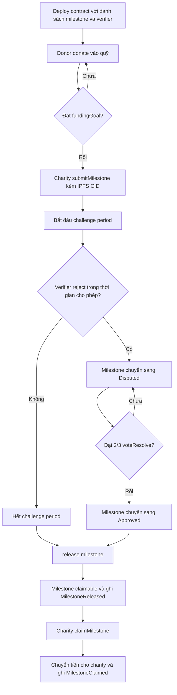

# Flowchart quy trình giải ngân milestone

```mermaid
flowchart TD
    A[Deploy contract với danh sách milestone và verifier] --> B[Donor donate vào quỹ]
    B --> C{Đạt fundingGoal?}
    C -- Chưa --> B
    C -- Rồi --> D[Charity submitMilestone kèm IPFS CID]
    D --> E[Bắt đầu challenge period]
    E --> F{Verifier reject trong thời gian cho phép?}
    F -- Không --> G[Hết challenge period]
    G --> H[release milestone]
    F -- Có --> I[Milestone chuyển sang Disputed]
    I --> J{Đạt 2/3 voteResolve?}
    J -- Chưa --> I
    J -- Rồi --> K[Milestone chuyển sang Approved]
    K --> H
    H --> L[Milestone claimable và ghi MilestoneReleased]
    L --> M[Charity claimMilestone]
    M --> N[Chuyển tiền cho charity và ghi MilestoneClaimed]
```
