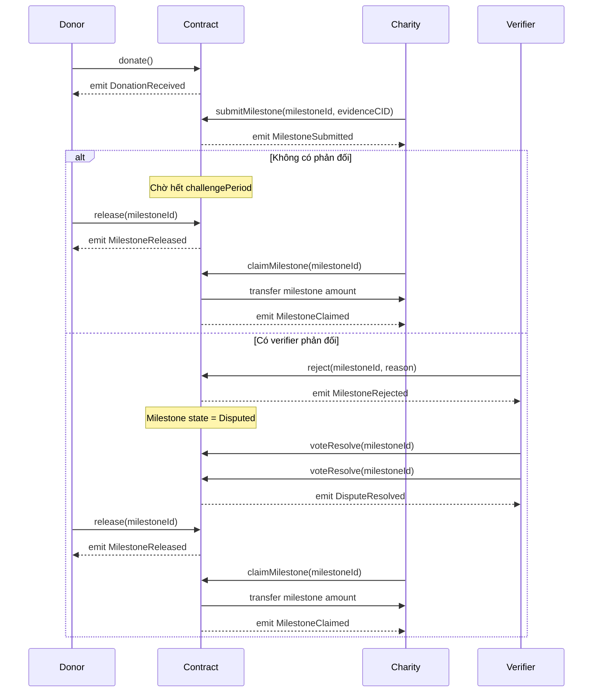

# Sequence diagram quy trình milestone

```mermaid
sequenceDiagram
    participant Donor
    participant Contract
    participant Charity
    participant Verifier

    Donor->>Contract: donate()
    Contract-->>Donor: emit DonationReceived

    Charity->>Contract: submitMilestone(milestoneId, evidenceCID)
    Contract-->>Charity: emit MilestoneSubmitted

    alt Không có phản đối
        Note over Contract: Chờ hết challengePeriod
        Donor->>Contract: release(milestoneId)
        Contract-->>Donor: emit MilestoneReleased
        Charity->>Contract: claimMilestone(milestoneId)
        Contract->>Charity: transfer milestone amount
        Contract-->>Charity: emit MilestoneClaimed
    else Có verifier phản đối
        Verifier->>Contract: reject(milestoneId, reason)
        Contract-->>Verifier: emit MilestoneRejected
        Note over Contract: Milestone state = Disputed
        Verifier->>Contract: voteResolve(milestoneId)
        Verifier->>Contract: voteResolve(milestoneId)
        Contract-->>Verifier: emit DisputeResolved
        Donor->>Contract: release(milestoneId)
        Contract-->>Donor: emit MilestoneReleased
        Charity->>Contract: claimMilestone(milestoneId)
        Contract->>Charity: transfer milestone amount
        Contract-->>Charity: emit MilestoneClaimed
    end
```
